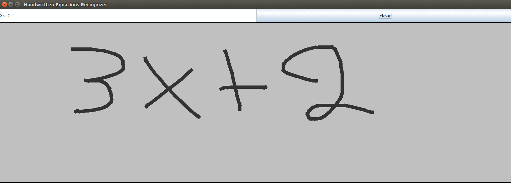

# Handwritten Equations Recognizer
Implementation of a stand alone Handwritten Equations Recognizer in Java

## Description
This project was developed in two parts. The first part was from June 2015 to August 2015 during
[Google Summer of Code 2015](https://www.google-melange.com/gsoc/homepage/google/gsoc2015)
under the [International Institute of Geogebra](http://wiki.geogebra.org/en/Comments:International_GeoGebra_Institute). The second part
was from September 2015 to February 2016 in collaboration with the International Institute of
GeoGebra. The goal of the project is the recognition of handwritten mathematical equations written
with a mouse or a pen or a touch screen.

## Implementation
The recognition engine uses Minimum Spanning Trees to separate the symbols of a given equation and
Feed Forward Neural Networks to classify these symbols. For more information about the work being
done by the recognition engine please read the
[white paper](https://docs.google.com/document/d/1M4iMJfxZABqRuptV3rpgzYlqsVsFWxV0dmcqm6FA9_A/edit?usp=sharing).
The implementation is partially based on [this thesis](http://www.ai.mit.edu/projects/natural-log/papers/matsakis-MEng-99.pdf).

## Getting the Code
To download the code to your local file system and work on it you have to do:

```bash
git clone https://github.com/gouzouni625/handwritten_equations_recognizer.git
```

## Building the Documentation
For the documentation, [Doxygen](http://www.doxygen.org) is used. To generate the documentation
pages, you have to install Doxygen and download the code to your local file system. After that, do:

```bash
cd handwritten_equations_recognizer/doxygen
doxygen Doxyfile
```

This will create two directories inside `handwritten_equations_recognizer/doxygen`, `html` and
`latex`. To view the documentation pages, open  `html/index.html` with a browser of your choice.

## Usage
To run the recognizer, you need to have [Gradle](http://gradle.org/) installed and follow the steps
bellow.

First, you need to download the code on your local file system. After that, you can use to build the
project with the following commands:

```bash
cd handwritten_equations_recognizer
gradle build
```

and then, you can use the following commands to run the recognizer:

```bash
cd build/libs
java -jar handwritten_equations_recognizer.jar
```

To erase some traces you can strike through them with a horizontal line from right to left as shown
at the image below:



## Efficiency
At the moment, the recognizer can recognize the following symbols:

0, 1, 2, 3, 4, 5, 6, 7, 8, 9,
a, c, e, g, i, l, n, o, s, t,
=, +, -, x, y, (, ), sqrt(square root), <, >, .(dot) .

It can recognize fractions, exponents, indices and square roots, all of arbitrary depth. Last but
not least, it can recognizer floating point numbers.

To get the best result possible, make sure your inputs comply with the following rules:

* Draw your symbols large and clear
* Ink traces that belong to the same symbol, should be connected
* Ink traces that do not belong to the same symbol, should not be connected
* Make sure fractions "wrap" all their children. Concretely, the fraction line should be longer
than the numerator and the denominator
* Make sure square roots "wrap" all their children. Concretely, the ink trace of the square root
symbol should be longer than all the symbols under it
* Exponents and indices should be, at least, half the size of their base. That is, in 5^{2}, 2
should be, at least, half the size of 5
